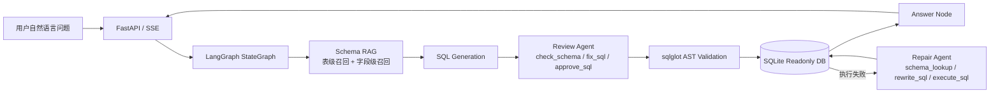
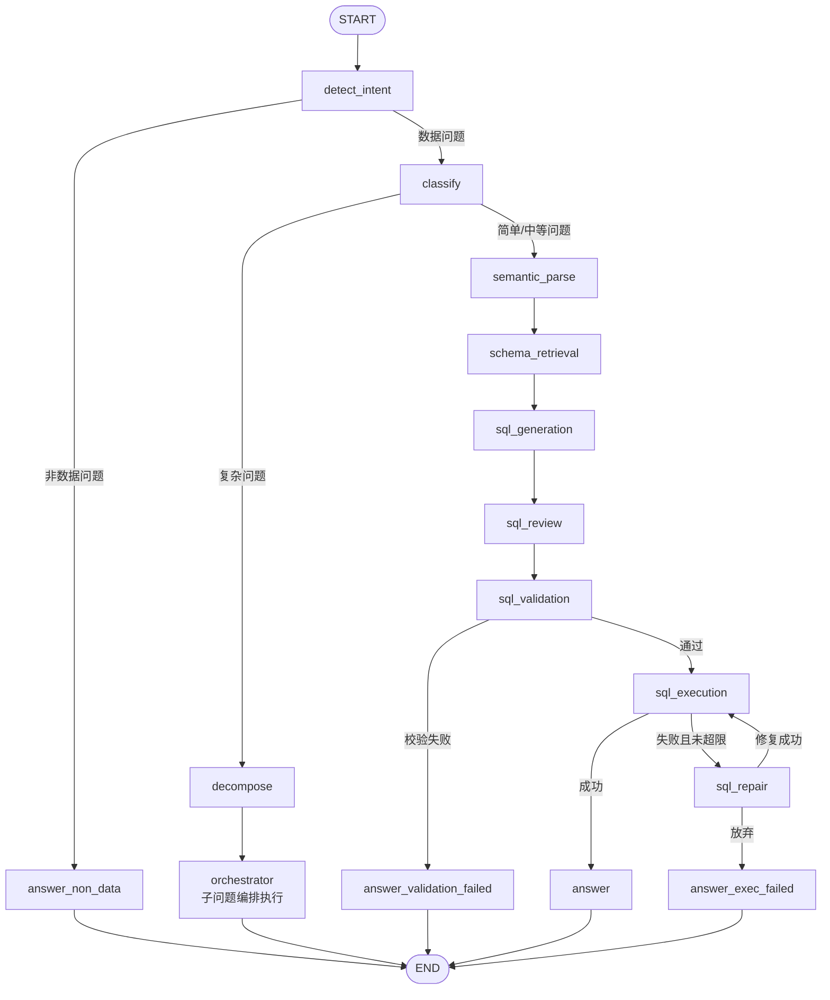

# Enterprise Text2SQL

Enterprise Text2SQL 是一个面向企业数据库的自然语言转 SQL Agent 系统。它不是把问题直接丢给大模型生成 SQL，而是把 Text2SQL 拆成可观测、可审查、可修复的工程工作流。

## 一句话

用户用自然语言提问，系统会检索相关 Schema、生成 SQL、执行前审查、AST 安全校验、只读执行、失败后自动修复，并把流程实时展示到前端。

## 适合谁用

- 想快速体验企业级 Text2SQL Agent 的开发者。
- 想把自然语言查询接到业务数据库上的数据/后端工程师。
- 想准备 AI Agent / Text2SQL / RAG / LangGraph 面试项目的人。

当前项目内置的是 SQLite 电商数据 demo。接入你自己的数据库需要补充 datasource 配置、生成 schema catalog，并确认执行层的只读权限策略。

## Demo 截图


## 系统架构



## 工作流



## 核心技术点

### 1. LangGraph 状态机

工作流定义在 `app/workflow/graph.py`。每个节点接收 `Text2SQLState`，返回局部状态更新，便于追踪、测试和替换。

关键分支：

- `detect_intent -> classify | answer_non_data`
- `classify -> semantic | decompose`
- `validate -> execute | answer_validation_failed`
- `execute -> answer | sql_repair | answer_exec_failed`
- `sql_repair -> execute | answer_exec_failed`

复杂问题会走 `decompose -> orchestrator`。`orchestrator` 内部复用主链路节点，逐个执行子问题，再合并最终答案。

### 2. 两级 Schema RAG

`SchemaService` 根据 `schema_catalog.json` 构建候选 schema：

- 小库：直接返回全量 schema，优先保证召回。
- 大库：启用 ChromaDB + Ollama `bge-m3`。
- 表级召回：先找相关表。
- 字段级召回：保留相关表内高分字段，并补充跨表高分字段。
- Schema hash：数据库结构不变时复用本地向量索引。

### 3. Review Agent

Review Agent 位于 SQL 生成之后、执行之前，使用 Function Calling 工具审查 SQL 是否真正回答了用户问题。

工具：

- `check_schema`：查询完整表结构。
- `fix_sql`：发现列名、JOIN、时间函数、聚合粒度问题时修正 SQL。
- `approve_sql`：确认 SQL 可以进入校验和执行。

### 4. Repair Agent

Repair Agent 位于执行失败之后，处理真实数据库错误：

- 查询 schema。
- 重写 SQL。
- 试执行。
- 达到重试上限后返回失败原因。

Review 是主动防错，Repair 是被动兜底，职责分离便于定位问题。

### 5. SQL AST 安全校验

SQL 校验使用 `sqlglot` AST：

- 只允许单条 SQL。
- 只允许 `SELECT`。
- 拦截 `INSERT`、`UPDATE`、`DELETE`、`DROP`、`CREATE`、`ALTER` 等 AST 节点。
- 表必须来自候选 schema。
- 没有 `LIMIT` 时给 warning，执行层自动追加最大返回行数限制。

## 快速开始：运行内置 Demo

```bash
pip install -r requirements.txt

copy .env.example .env
# 修改 .env 里的 LLM API Key / URL / MODEL

python scripts/init_ecommerce_db.py
python scripts/build_schema_catalog.py

uvicorn app.main:app --reload
```

浏览器打开：

```text
http://localhost:8000/demo
```

## 接入你自己的数据库

当前仓库默认接的是 `data/ecommerce.db`。如果要换成自己的数据库，建议按这个顺序做：

1. 在 `app/services/db_service.py` 增加新的 `datasource_id` 和连接方式。
2. 生成或维护对应的 `data/schema_catalog.json`，包含表、字段、主键、外键、样例值和业务描述。
3. 如果表数量较多，启动 Ollama 并拉取 embedding 模型：

```bash
ollama pull bge-m3
```

4. 运行 schema 构建脚本或自己生成 catalog：

```bash
python scripts/build_schema_catalog.py
```

5. 确认数据库账号只有只读权限。即使系统有 AST 校验，也不要给生产写权限。
6. 使用 `/demo` 或 `/api/text2sql` 验证问题链路。

## API

普通接口：

```http
POST /api/text2sql
Content-Type: application/json

{
  "user_id": "demo",
  "question": "销售额最高的前 10 个商品是什么？",
  "datasource_id": "ecommerce_db",
  "session_id": "demo"
}
```

流式接口：

```http
POST /api/text2sql/stream
```

返回 Server-Sent Events，前端用它实时点亮 LangGraph 节点。

## 评测

内置评测集包含 60 道题，指标是 Execution Accuracy：生成 SQL 的执行结果是否和标准 SQL 结果一致。

```bash
python scripts/run_evaluation.py --preset deepseek_v4_flash
python scripts/run_evaluation.py --preset mimo_2_5_flash --tag v2
python scripts/run_evaluation.py --compare
```

已有结果：

| 模型 | 准确率 | 简单题 | 中等题 | Token | 平均耗时 |
| --- | ---: | ---: | ---: | ---: | ---: |
| DeepSeek V4 Flash | 81.7% | 97% | 78% | 509K | 33.7s |
| MiMo 2.5 Flash | 80.0% | 97% | 74% | 476K | 40.1s |

Bad case 迭代：

- v1 准确率 80.0%。
- 失败样本主要来自列名语义错误、状态字段误用、JOIN 链路缺失、日期函数参数缺失。
- v2 增加 Review Agent 的候选 schema 逐列核对。
- 中等题准确率从 74% 提升到 78%。

## 测试

```bash
python -m pytest -q
python -m compileall app -q
```

## 项目结构

```text
enterprise_text2sql/
  app/
    agents/       # Review Agent / Repair Agent
    api/          # FastAPI routes
    nodes/        # LangGraph nodes
    prompts/      # Prompt templates
    schemas/      # Request / response / workflow state
    services/     # LLM / Schema / DB / SQL services
    tools/        # Function Calling tools
    workflow/     # Graph definition and orchestrator
  data/           # SQLite DB, schema catalog, eval set
  docs/           # 面试讲解、设计文档、截图
  frontend/       # HTML/CSS/JS demo page
  scripts/        # DB init, schema build, evaluation
  tests/          # Unit and workflow tests
  output/         # Evaluation outputs
```

## 面试讲解重点

一句话：

> 我做的是一个企业级 Text2SQL Agent 系统，核心不是单次生成 SQL，而是用 Schema RAG、执行前 Review、执行后 Repair 和可观测工作流，把自然语言查询变成可控的工程系统。

重点展开：

- 为什么 Text2SQL 不能只靠 prompt。
- 为什么大库需要 Schema RAG。
- Review Agent 和 Repair Agent 的边界。
- 为什么 SQL 安全校验要用 AST。
- 如何用评测集和 bad case 驱动迭代。

## License

MIT
