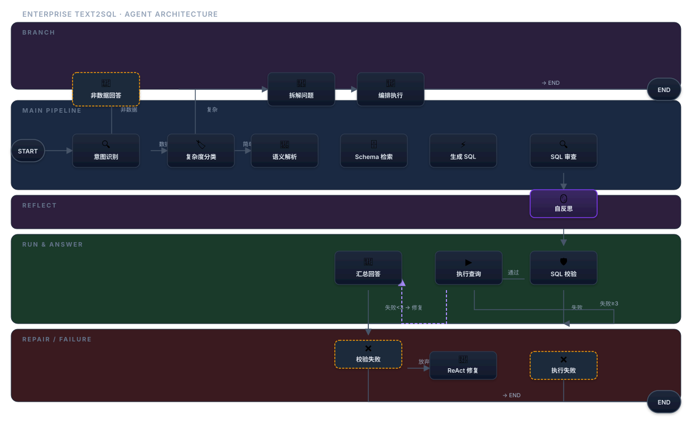
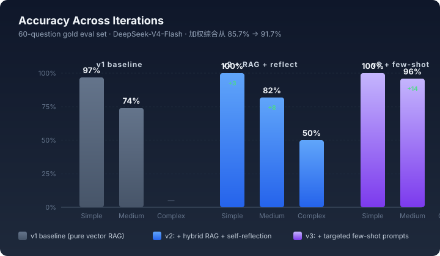

# Enterprise Text2SQL Agent

> **自然语言问数据库，AI 自动写 SQL、查库、汇总回答。**
>
> 17 节点 LangGraph Agent · 4 阶段 RAG · Self-Reflection · ReAct 自修复 · 加权评测 91.7%

<p>
  <a href="LICENSE"></a>
  
  
  <a href="https://hub.docker.com/r/huanghairui/enterprise-text2sql"></a>
  
  
</p>

---

## ⚡ 30 秒跑起来

需要一个 LLM API key（[DeepSeek](https://platform.deepseek.com) 或 [硅基流动](https://siliconflow.cn) 都行，免费注册即用）。

```bash
git clone https://github.com/hr-huang/text2sql.git
cd text2sql

cp .env.example .env
# 编辑 .env 填入 DEEPSEEK_V4_FLASH_KEY 和 SILICONFLOW_API_KEY

docker compose up
```

打开 http://localhost:8000/demo

或者一行命令从 Docker Hub 拉（需要你本地有 `.env`）：

```bash
docker run -p 8000:8000 --env-file .env huanghairui/enterprise-text2sql:v1.0.1
```

---

## 🗣️ 试试这些问题

进聊天界面后随便问：

```
•  上个月销售额超过 5000 元的商品有哪些？
•  各物流公司的签收率是多少？
•  客户里有多少是 VIP？
•  价格高于品类均价的商品有哪些？
```

AI 会自动：

1. 听懂你在问什么
2. 找相关数据库表
3. 生成 SQL
4. 跑数据库
5. 用人话回答 + 展示流程图

---

## 🏗️ 架构



5 个泳道、17 个节点、4 阶段 RAG 检索。点 [docs/PROJECT_OVERVIEW.md](docs/PROJECT_OVERVIEW.md) 看完整讲解（给非技术人也能看懂 + 给面试官讲技术取舍）。

---

## 📊 评测结果

60 道手工标注的题（simple 29 / medium 27 / complex 4），跨 3 轮迭代：



| 迭代 | Simple | Medium | Complex | 加权 |
|---|---|---|---|---|
| v1（基线） | 97% | 74% | — | — |
| + RAG + 自反思 | 100% | 82% | 50% | 88.6% |
| **+ 定向 few-shot** | **100%** | **96%** | 50% | **91.7%** |

**怎么涨的**：跑评测 → 9 类失败归因 → 找出 5 道中等题错题全是"多 JOIN 路径选错"或"状态表用错" → 写 4 个针对性 few-shot 加进 prompt → 重跑验证 +14pp。

---

## ✨ 关键能力

| | 能力 | 实现 |
|---|---|---|
| 🧠 | **Agent 编排** | LangGraph StateGraph + 条件路由 + ReAct 循环 |
| 🛠️ | **工具调用** | SQL Review Agent 用 Function Calling 调 schema_lookup 工具 |
| 🧩 | **多步规划** | 复杂问题自动拆解为子问题 + 拓扑排序执行 |
| 🪞 | **自我反思** | Self-Reflection 节点让 LLM 自评 SQL 风险等级 |
| 🔁 | **自修复** | ReAct 模式：SQL 失败时调工具诊断，最多重试 3 次 |
| 🔍 | **多阶段 RAG** | 向量 (bge-m3) + BM25 (rank_bm25) + RRF 融合 + Rerank (bge-reranker-v2-m3) |
| 📊 | **可观测性** | trace_wrapper 自动采集每节点耗时 + Token + Tool 调用 |
| 🧪 | **评测闭环** | 60 题黄金集 + 9 类失败归因自动报告 |
| 🐳 | **一键部署** | Docker + Docker Compose，已发布至 [Docker Hub](https://hub.docker.com/r/huanghairui/enterprise-text2sql) |

---

## 🛠️ 技术栈

| 层 | 技术 |
|---|---|
| Agent 编排 | LangGraph 1.0+ |
| LLM | DeepSeek / Qwen / Gemini / Kimi / MiMo（OpenAI 兼容，12 预设） |
| Embedding + Rerank | 硅基流动 `BAAI/bge-m3` + `BAAI/bge-reranker-v2-m3` |
| 关键词检索 | rank_bm25 + jieba |
| 融合算法 | RRF (Reciprocal Rank Fusion) |
| 向量库 | ChromaDB（持久化 + schema hash 缓存） |
| 后端 | FastAPI + SSE 流式 |
| 前端 | 原生 HTML/CSS/JS + ECharts + SVG |
| 数据库 | SQLite（只读） |
| SQL 工具 | sqlglot |
| 容器化 | Docker + Docker Compose |

---

## 📁 项目结构

```
app/
├── agents/         # 独立 Agent 单元（SQL 审查 / ReAct 修复）
├── api/routes/     # FastAPI 路由
├── nodes/          # 17 个 LangGraph 节点
├── prompts/        # 集中管理所有 prompt
├── schemas/        # TypedDict state + Pydantic
├── services/       # db / llm / schema 三个核心服务
├── workflow/       # StateGraph 装配 + orchestrator + trace
└── utils/

scripts/
├── run_evaluation.py        # 评测主入口
├── analyze_bad_cases.py     # 9 类失败归因
├── deploy_docker.sh         # 一键推 Docker Hub
└── pull_and_run.sh          # 一键拉取并启动

frontend/           # 单页 SPA（无打包）
data/               # 评测集 + Schema + SQLite
docs/               # 架构图、评测图、详细讲解
output/             # 评测输出（gitignore）
```

---

## 🔬 跑评测

```bash
# 用 .env 里的 LLM_PRESET 跑
python scripts/run_evaluation.py --tag my_exp

# 指定难度
python scripts/run_evaluation.py --difficulty medium

# 失败归因
python scripts/analyze_bad_cases.py deepseek_v4_flash

# 多模型对比
python scripts/run_evaluation.py --all
```

输出在 `output/<preset>/`，含 `summary.json` 和 `bad_cases.md`。

---

## 📚 进阶阅读

- **[docs/PROJECT_OVERVIEW.md](docs/PROJECT_OVERVIEW.md)** — 完整项目讲解（分 3 层：非技术人、技术人、面试官视角）
- **[docs/architecture.svg](docs/architecture.svg)** — 架构图源文件
- **[CONTRIBUTING.md](CONTRIBUTING.md)** — 如何贡献

---

## 🗺️ Roadmap

- [ ] 多模型路由（简单题用小模型省 token）
- [ ] 查询缓存（重复问题直接返回）
- [ ] Query Rewrite（用户口语 → 标准查询）
- [ ] MCP Server 化
- [ ] 多数据库接入（MySQL / PG）
- [ ] LangSmith / LangFuse 集成

---

## 📄 License

MIT — 详见 [LICENSE](LICENSE)。

---

> 求职项目 · 目标岗位：AI Agent 工程师 · 重点展示：Tool Use / Planning / Reflection / ReAct / Observability / Evaluation
