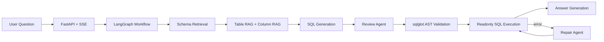
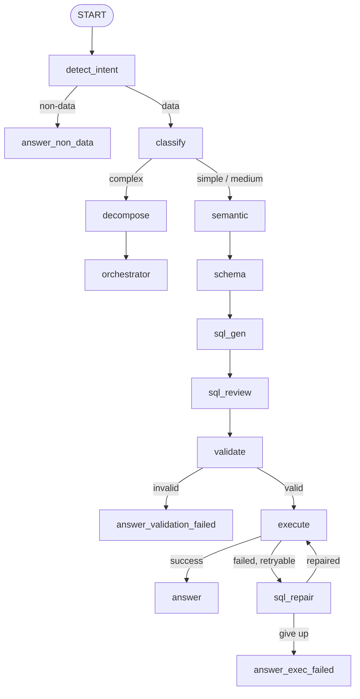

# Enterprise Text2SQL

Enterprise Text2SQL 是一个面向企业数据库的自然语言查询系统。用户输入中文问题后，系统会检索相关 Schema、生成 SQL、执行语义 Review、做 AST 安全校验、只读执行查询，并在失败时尝试修复，前端会实时展示整条 LangGraph 工作流的节点状态。

这个项目不是一个只靠 Prompt 的演示，而是把 Text2SQL 做成一个可评测、可追踪、有安全边界、有错误恢复路径的工程系统。

<p align="center">
  <a href="docs/assets/demo-flow-wide.svg">
    
  </a>
</p>

## 项目结果

固定评测集共 60 题，包含 29 道简单题、27 道中等题和 4 道复杂题。核心指标是 Execution Accuracy：生成 SQL 的执行结果必须和 `gold_sql` 的执行结果一致才算通过。

| 模型 | 版本 | 正确率 | 通过 | 简单 | 中等 | 复杂 | 平均耗时 |
| --- | --- | ---: | ---: | ---: | ---: | ---: | ---: |
| DeepSeek V4 Flash | v8 | **91.7%** | 55 / 60 | 29 / 29 | 23 / 27 | 3 / 4 | 44.9s |
| DeepSeek V4 Flash | v1 | 80.0% | 48 / 60 | 28 / 29 | 20 / 27 | 0 / 4 | 29.3s |
| MiMo 2.5 Flash | v2 | 80.0% | 48 / 60 | 28 / 29 | 20 / 27 | 0 / 4 | 40.1s |
| MiMo Flash | v1 | 78.3% | 47 / 60 | 28 / 29 | 19 / 27 | 0 / 4 | 61.7s |

从 v1 到 v8 的主要提升：

- 总正确率：**80.0% -> 91.7%**
- 简单题：**28 / 29 -> 29 / 29**
- 中等题：**20 / 27 -> 23 / 27**
- 复杂题：**0 / 4 -> 3 / 4**

完整评测说明见 [docs/EVALUATION.md](docs/EVALUATION.md)，跨模型摘要保存在 [output/comparison.json](output/comparison.json)。

## 核心能力

- **LangGraph 工作流**：用 StateGraph 明确拆分意图识别、复杂度分类、Schema 检索、SQL 生成、Review、安全校验、执行、修复和回答生成。
- **两级 Schema RAG**：小库直接返回完整 Schema，大库走 ChromaDB + BGE-M3 embedding，先召回表，再召回字段。
- **Review Agent**：在 SQL 进入数据库前检查业务语义、字段使用、JOIN 路径、聚合粒度和时间函数。
- **AST 级 SQL 安全校验**：基于 `sqlglot` 解析 SQL，只允许单条 `SELECT`，拒绝写操作、DDL、多语句和候选表外查询。
- **Repair Agent**：执行失败后可查 Schema、改写 SQL、重试执行，达到上限后返回可解释失败原因。
- **SSE 实时链路展示**：前端通过 Server-Sent Events 展示每个工作流节点的状态、SQL、回答、置信度和结果预览。
- **可复现评测**：内置 60 题评测集和跨模型对比脚本，避免只凭主观 demo 判断效果。

## 技术栈

| 层级 | 技术 |
| --- | --- |
| Workflow | LangGraph StateGraph |
| API | FastAPI, Server-Sent Events |
| LLM | OpenAI-compatible API, Function Calling |
| Schema 检索 | ChromaDB, BGE-M3 embedding, Schema hash cache |
| SQL 安全 | sqlglot AST validation |
| 数据库 | SQLite demo, readonly execution layer |
| 前端 | HTML, CSS, JavaScript, SVG flow trace |
| 评测 | 60-question execution-accuracy benchmark |

## 系统架构



主工作流：



## 本地运行

```bash
pip install -r requirements.txt

copy .env.example .env
# 在 .env 中填写 OpenAI-compatible LLM endpoint 和 API key

python scripts/init_ecommerce_db.py
python scripts/build_schema_catalog.py

uvicorn app.main:app --reload
```

打开演示页面：

```text
http://localhost:8000/demo
```

健康检查：

```text
http://localhost:8000/health
```

示例问题：

- 销售额最高的前 10 个商品是什么？
- 各品类商品数量占比是多少？
- 按月份统计下单数量趋势。
- 每个地区的客户数量是多少？

## API

### 普通请求

```http
POST /api/text2sql
Content-Type: application/json

{
  "user_id": "demo",
  "question": "销售额最高的前 10 个商品是什么？",
  "datasource_id": "ecommerce_db",
  "session_id": "demo"
}
```

响应字段：

| 字段 | 说明 |
| --- | --- |
| `answer` | 面向用户的自然语言回答 |
| `sql` | 生成并通过校验的 SQL |
| `rows` | 查询结果 |
| `confidence` | 系统置信度 |
| `trace_id` | 本次链路追踪 ID |
| `warnings` | SQL 或执行阶段产生的警告 |
| `debug_trace` | 工作流节点调试链路 |

### 流式请求

```http
POST /api/text2sql/stream
Content-Type: application/json
```

流式接口返回 `text/event-stream`，前端用它实时点亮工作流节点，并展示 SQL、回答、结果行数和中间状态。

### Schema 浏览

```http
GET /api/schema?datasource_id=ecommerce_db
```

该接口返回数据源中的表、字段、主键、样例值和估算行数，用于前端 Schema 浏览器。

## 接入自己的数据库

当前仓库内置 SQLite 电商 demo。接入真实数据库时，建议按这个顺序做：

1. 在 `app/services/db_service.py` 增加新的 `datasource_id` 和只读连接。
2. 生成匹配的 `data/schema_catalog.json`，包含表、字段、主键、外键、业务描述和样例值。
3. 如果 Schema 很大，启动 BGE-M3 embedding 服务并重建向量索引。
4. 数据库账号必须只有只读权限，不要把安全性寄托在 Prompt 上。
5. 上线前补一套领域评测集，用 `scripts/run_evaluation.py` 跑执行准确率。

## 评测复现

```bash
python scripts/init_ecommerce_db.py
python scripts/build_schema_catalog.py
python -m scripts.run_evaluation --preset deepseek_v4_flash --tag v8
python -m scripts.run_evaluation --compare
```

仓库保留的核心证据：

- `data/eval_questions.json`：60 道评测题，每题包含 `gold_sql`。
- `data/schema_catalog.json`：Schema 检索和 Prompt 构建使用的目录。
- `output/comparison.json`：跨模型、跨版本的精简结果汇总。

逐题大文件是本地生成物，不建议提交到 Git。

## 测试

```bash
python -m pytest -q
python -m compileall app -q
```

当前测试覆盖：

- SQL 只读安全校验。
- CTE 和子查询校验。
- Workflow 路由。
- 结果比较逻辑。
- 只读执行和 LIMIT 处理。

## 目录结构

```text
app/
  agents/       Review Agent and Repair Agent
  api/          FastAPI routes and SSE endpoint
  nodes/        LangGraph node implementations
  prompts/      Prompt templates
  schemas/      Request, response, and workflow state models
  services/     LLM, schema, SQL, and DB services
  tools/        Function Calling tools
  workflow/     Graph definition and complex-question orchestrator
data/
  eval_questions.json
  schema_catalog.json
docs/
  EVALUATION.md
  INTERVIEW.md
  assets/
frontend/
  index.html
  style.css
  app.js
scripts/
  init_ecommerce_db.py
  build_schema_catalog.py
  run_evaluation.py
tests/
```

## 文档入口

- [docs/EVALUATION.md](docs/EVALUATION.md)：评测集、指标、版本对比和复现方式。
- [docs/assets/](docs/assets/)：README 和演示页面使用的流程图资源。

## Roadmap

- 将复杂问题的子问题执行过程也通过 SSE 展示到前端。
- 增加 SQLite 之外的数据库适配器。
- 增加 SQL 执行计划检查，提前发现高成本查询。
- 增加领域评测集生成工具。

## License

MIT
