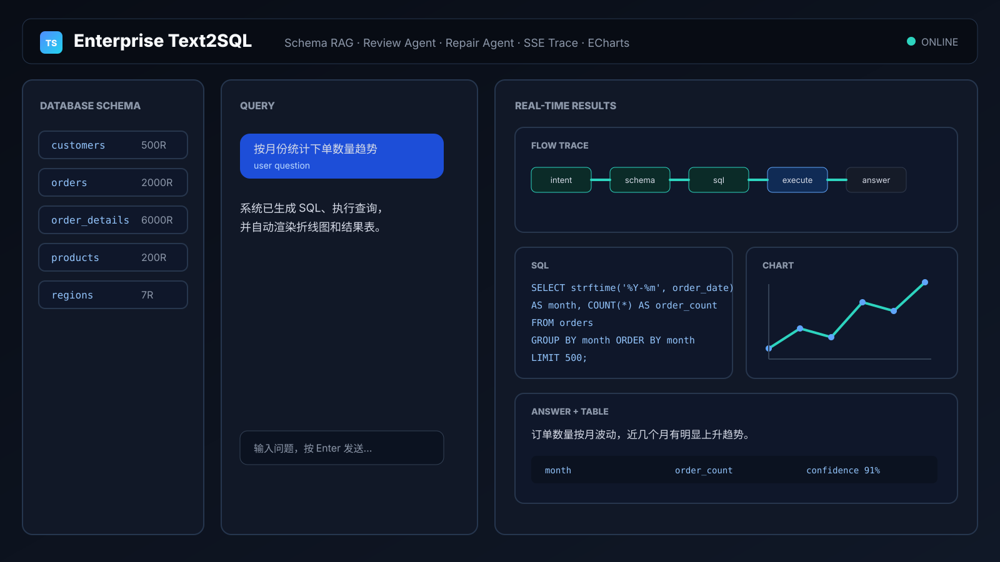
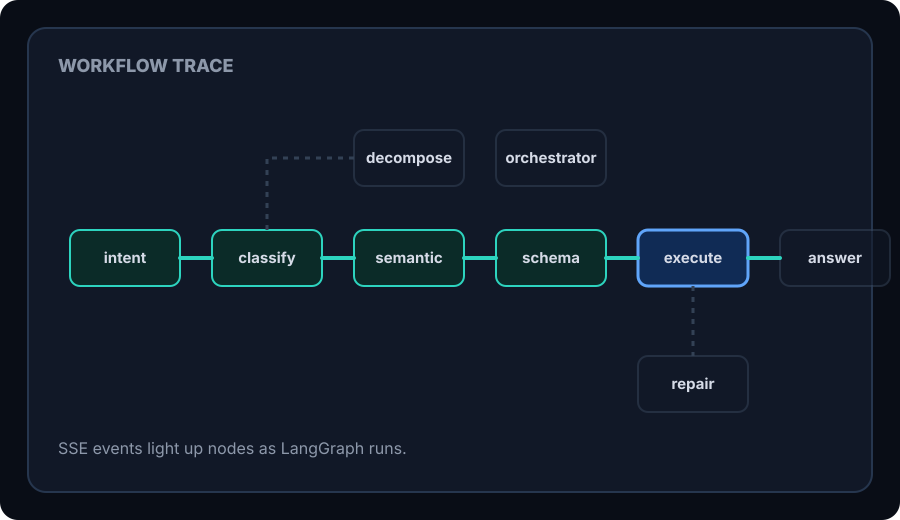
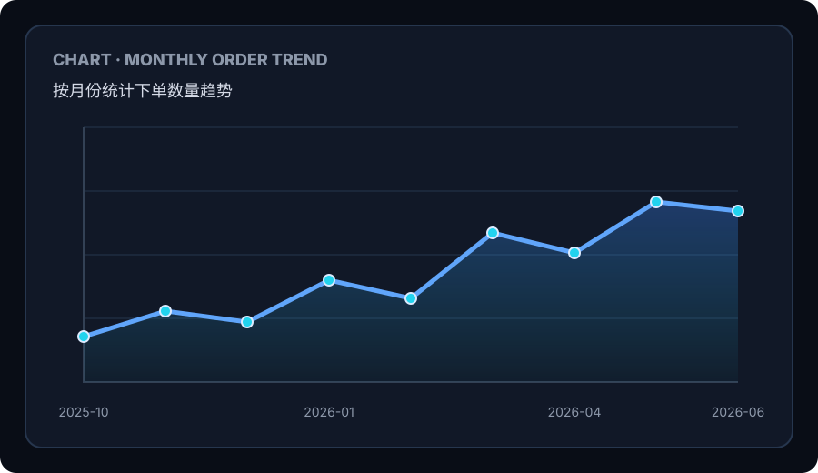
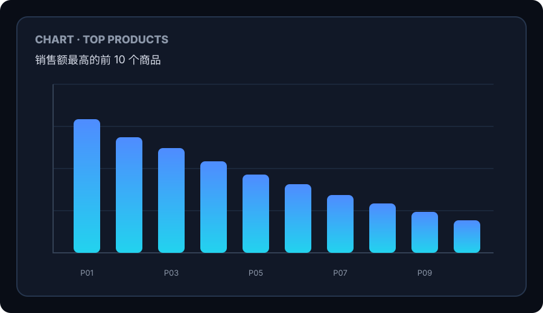
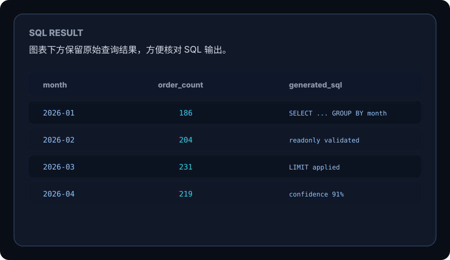
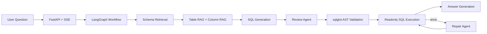

# Enterprise Text2SQL

Enterprise Text2SQL 是一个面向企业数据库的自然语言查询系统。用户输入中文问题后，系统会检索 Schema、生成 SQL、执行 Review、安全校验、只读查询，并把 LangGraph 工作流、SQL、回答、表格和图表实时展示到前端。

> [!IMPORTANT]
> 默认项目跑的是内置 SQLite 电商 demo。别人 clone 后可以直接初始化 demo 数据库并体验完整链路；如果要接自己的数据库，需要新增只读数据源适配并维护 Schema Catalog，不是只跑脚本就能自动连接任意数据库。

<p align="center">
  <a href="docs/assets/demo-interface.svg">
    
  </a>
</p>

## Features

- Natural language to readonly SQL.
- LangGraph workflow with intent detection, classification, schema retrieval, SQL generation, review, validation, execution, repair, and answer generation.
- Schema RAG with table and column retrieval for larger schemas.
- Review Agent checks semantic correctness before SQL execution.
- `sqlglot` AST validation blocks non-`SELECT`, DDL, DML, multi-statement SQL, and tables outside the candidate schema.
- Repair Agent retries failed SQL with schema lookup and rewritten SQL.
- Frontend renders workflow trace, SQL, natural-language answer, result table, confidence, and ECharts charts.
- Evaluation loop based on execution accuracy, not subjective demo output.

## Demo UI

The frontend is not only a chat box. It is built for debugging and demo review: left side shows the database schema, center is the query panel, right side streams workflow progress, generated SQL, answer, charts, and raw rows.

<p align="center">
  
  
</p>
<p align="center">
  
  
</p>

Chart rendering is automatic:

- Questions with time-like dimensions, such as monthly order trend, render as line charts.
- Short categorical distributions, such as order status or product category share, render as pie charts.
- Ranking questions, such as top-selling products, render as bar charts.
- All rows are still available in the data table under the chart.

## Results

The benchmark contains 60 questions: 29 simple, 27 medium, and 4 complex. A generated SQL query is counted as correct only when its execution result matches the `gold_sql` result.

| Model | Version | Accuracy | Passed | Simple | Medium | Complex | Avg time |
| --- | --- | ---: | ---: | ---: | ---: | ---: | ---: |
| DeepSeek V4 Flash | v8 | **91.7%** | 55 / 60 | 29 / 29 | 23 / 27 | 3 / 4 | 44.9s |
| DeepSeek V4 Flash | v1 | 80.0% | 48 / 60 | 28 / 29 | 20 / 27 | 0 / 4 | 29.3s |
| MiMo 2.5 Flash | v2 | 80.0% | 48 / 60 | 28 / 29 | 20 / 27 | 0 / 4 | 40.1s |
| MiMo Flash | v1 | 78.3% | 47 / 60 | 28 / 29 | 19 / 27 | 0 / 4 | 61.7s |

See [docs/EVALUATION.md](docs/EVALUATION.md) and [output/comparison.json](output/comparison.json) for the reproducible evaluation summary.

## Architecture



Main workflow:


## Quickstart

### 1. Install dependencies

Windows PowerShell:

```powershell
python -m venv .venv
.\.venv\Scripts\Activate.ps1
pip install -r requirements.txt
```

macOS / Linux:

```bash
python -m venv .venv
source .venv/bin/activate
pip install -r requirements.txt
```

### 2. Configure the LLM endpoint

```powershell
Copy-Item .env.example .env
```

Edit `.env`:

```env
LLM_PRESET=deepseek_v4_flash
DEEPSEEK_V4_FLASH_KEY=your_api_key_here
DEEPSEEK_V4_FLASH_URL=https://api.example.com/v1
DEEPSEEK_V4_FLASH_MODEL=deepseek-v4-flash
```

The project uses an OpenAI-compatible API. Any provider that supports a compatible chat-completions interface can be wired through the preset environment variables.

### 3. Create the demo database and schema catalog

```powershell
python scripts/init_ecommerce_db.py
python scripts/build_schema_catalog.py
```

This creates:

- `data/ecommerce.db`: the local SQLite ecommerce demo database.
- `data/schema_catalog.json`: the schema metadata used by retrieval and prompts.

### 4. Start the app

```powershell
uvicorn app.main:app --reload
```

Open:

```text
http://localhost:8000/demo
```

Try:

- 销售额最高的前 10 个商品是什么？
- 各品类商品数量占比是多少？
- 按月份统计下单数量趋势。
- 每个地区的客户数量是多少？

## API

### Synchronous query

```http
POST /api/text2sql
Content-Type: application/json

{
  "user_id": "demo",
  "question": "销售额最高的前 10 个商品是什么？",
  "datasource_id": "ecommerce_db",
  "session_id": "demo"
}
```

### Streaming query

```http
POST /api/text2sql/stream
Content-Type: application/json
```

The stream returns `text/event-stream` events. The frontend uses it to update workflow nodes, SQL, answer text, row count, and charts while the query is running.

### Schema browser

```http
GET /api/schema?datasource_id=ecommerce_db
```

## Use Your Own Database

The default data source is configured in [app/services/db_service.py](app/services/db_service.py):

```python
self.datasource_map = {
    "ecommerce_db": project_root / "data" / "ecommerce.db",
}
```

### If your database is SQLite

1. Put your database file in the project, for example `data/my_company.db`.
2. Build a schema catalog:

   ```powershell
   python scripts/build_schema_catalog.py data/my_company.db my_company_db
   ```

3. Add the data source in [app/services/db_service.py](app/services/db_service.py):

   ```python
   self.datasource_map = {
       "ecommerce_db": project_root / "data" / "ecommerce.db",
       "my_company_db": project_root / "data" / "my_company.db",
   }
   ```

4. Use `"datasource_id": "my_company_db"` in API requests.

> [!NOTE]
> `scripts/build_schema_catalog.py` can extract table names, columns, primary keys, foreign keys, and sample values. For better Text2SQL accuracy, manually enrich `business_name`, `description`, relationship descriptions, and business rules in `data/schema_catalog.json`.

### If your database is MySQL, PostgreSQL, SQL Server, or another engine

You need to add an adapter. The current implementation is SQLite-first.

1. Add a readonly connection path in [app/services/db_service.py](app/services/db_service.py).
2. Give the data source a stable `datasource_id`, such as `finance_prod_readonly`.
3. Use a database account with readonly permissions only.
4. Generate or maintain a matching `data/schema_catalog.json`.
5. Review [app/services/sql_service.py](app/services/sql_service.py) for SQL dialect and safety-rule compatibility.
6. Build a domain-specific evaluation set in `data/eval_questions.json`.
7. Run evaluation before exposing the system to real users.

Do not connect production directly on the first attempt. Start with a readonly account, a sanitized sample database, and a small evaluation set.

## Evaluation

```powershell
python -m scripts.run_evaluation --preset deepseek_v4_flash --tag v8
python -m scripts.run_evaluation --compare
```

Tracked evaluation artifacts:

- [data/eval_questions.json](data/eval_questions.json): 60 benchmark questions with `gold_sql`.
- [data/schema_catalog.json](data/schema_catalog.json): schema metadata for retrieval and prompt construction.
- [output/comparison.json](output/comparison.json): compact cross-model and cross-version summary.

## Tests

```powershell
python -m pytest -q
python -m compileall app scripts -q
```

## Project Layout

```text
app/
  agents/       Review Agent and Repair Agent
  api/          FastAPI routes and SSE endpoint
  nodes/        LangGraph node implementations
  prompts/      Prompt templates
  schemas/      Request, response, and workflow state models
  services/     LLM, schema, SQL, and DB services
  tools/        Function Calling tools
  workflow/     Graph definition and complex-question orchestrator
data/
  eval_questions.json
  schema_catalog.json
docs/
  EVALUATION.md
  assets/
frontend/
  index.html
  style.css
  app.js
scripts/
  init_ecommerce_db.py
  build_schema_catalog.py
  run_evaluation.py
tests/
```
