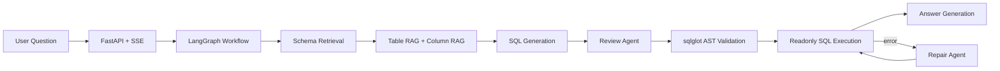
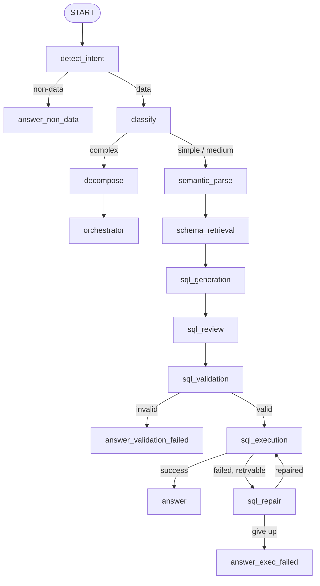

# Enterprise Text2SQL

面向企业数据库的 Text2SQL Agent 系统。用户输入自然语言问题后，系统会自动检索相关 Schema、生成 SQL、执行前审查、AST 安全校验、只读执行、失败修复，并在前端实时展示每个节点的流转状态。

我做这个项目的目标不是“写一个能演示的 Prompt Demo”，而是把 Text2SQL 做成一个有评测、有安全边界、有错误恢复、有可观测链路的工程系统。

<p align="center">
  <a href="docs/assets/demo-flow-wide.svg">
    
  </a>
</p>

## 项目结果

固定评测集共 60 题，包含 29 道简单题、27 道中等题、4 道复杂题。指标是 Execution Accuracy：生成 SQL 的执行结果必须和 `gold_sql` 结果一致才算通过。

| 模型 | 版本 | 正确率 | 简单 | 中等 | 复杂 | 平均耗时 |
| --- | --- | ---: | ---: | ---: | ---: | ---: |
| DeepSeek V4 Flash | v8 | **91.7%** | 100.0% | 85.2% | 75.0% | 44.9s |
| DeepSeek V4 Flash | v1 | 80.0% | 96.6% | 74.1% | 0.0% | 29.3s |
| MiMo 2.5 Flash | v2 | 80.0% | 96.6% | 74.1% | 0.0% | 40.1s |
| MiMo Flash | v1 | 78.3% | 96.6% | 70.4% | 0.0% | 61.7s |

从 v1 到 v8 的主要提升：

- 总正确率：**80.0% -> 91.7%**
- 简单题：**96.6% -> 100.0%**
- 中等题：**74.1% -> 85.2%**
- 复杂题：**0 / 4 -> 3 / 4**

完整评测报告：[docs/EVALUATION.md](docs/EVALUATION.md)

## 技术栈

| 层级 | 技术 |
| --- | --- |
| Workflow | LangGraph StateGraph |
| API | FastAPI, Server-Sent Events |
| LLM | OpenAI-compatible API, Function Calling |
| 检索 | ChromaDB, BGE-M3 embedding, Schema hash cache |
| SQL 安全 | sqlglot AST validation |
| 数据库 | SQLite demo, readonly execution layer |
| 前端 | HTML, CSS, JavaScript, SVG flow trace |
| 评测 | 60-question execution-accuracy benchmark |

## 为什么这个问题不简单

企业 Text2SQL 的难点不只是“把中文翻译成 SQL”：

1. 企业库表多、字段多，直接把全量 Schema 塞给模型会浪费 token，也容易选错字段。
2. SQL 可能语法正确但语义错误，比如状态字段用错、JOIN 路径不完整、时间函数参数不对。
3. LLM 输出不能直接进数据库，必须有确定性的安全边界。
4. 复杂问题往往需要拆成多个子问题，单条 SQL 不一定能稳定解决。
5. 项目必须能评测，否则无法证明每次修改真的变好。

这个项目用“工作流 + Agent + 评测”的方式解决这些问题。

## 系统架构



主工作流：



## 核心设计

### 1. LangGraph 工作流

工作流定义在 `app/workflow/graph.py`。每个节点接收 `Text2SQLState`，返回局部状态更新，因此链路可以追踪、测试和替换。

- `detect_intent` 提前拒绝非数据问题。
- `classify` 区分简单、中等、复杂问题。
- 条件边处理校验失败、执行失败和修复重试。
- 复杂问题进入 `decompose -> orchestrator`，先拆子问题，再逐个执行并合并结果。

### 2. 两级 Schema RAG

`app/services/schema_service.py` 根据 `data/schema_catalog.json` 构建候选 Schema 上下文。

小库直接返回全量 Schema，优先保证召回率。大库启用 ChromaDB + BGE-M3：

- 表级召回先找相关业务实体。
- 字段级召回保留相关字段，并补充跨表高分字段。
- 关系过滤保留可用 JOIN 路径。
- Schema hash 缓存避免重复构建向量索引。

### 3. 执行前 Review Agent

`app/agents/sql_review_agent.py` 在 SQL 进入数据库之前做语义审查。

它可以调用：

- `check_schema`：查看完整表结构。
- `fix_sql`：修正语义错误 SQL。
- `approve_sql`：确认 SQL 可以进入校验和执行。

这一步主要解决“语法正确但业务语义错误”的问题。

### 4. AST SQL 安全校验

`app/services/sql_service.py` 使用 `sqlglot` AST 校验 SQL，而不是简单做字符串关键字匹配。

它会拒绝：

- 多语句。
- 非 `SELECT` 根节点。
- `INSERT`、`UPDATE`、`DELETE`、`DROP`、`CREATE`、`ALTER` 等危险 AST 节点。
- 不在候选 Schema 中的表。

这样既能拦截写操作，又不会误杀 `delete_count` 这类普通字段名。

### 5. 执行后 Repair Agent

`app/agents/react_sql_repair_agent.py` 处理真实数据库执行错误。它可以查 Schema、重写 SQL、重试执行，也可以在达到重试上限后返回失败原因。

Review 负责主动防错，Repair 负责被动兜底。

### 6. 前端流程可视化

前端不是普通聊天框，而是把 LangGraph 的执行状态直接展示出来：

- 左侧展示数据库 Schema 和字段信息。
- 中间是自然语言查询入口和示例问题。
- 右侧用 SVG 流程图展示节点状态：pending、active、done、skipped。
- SSE 事件到达时，前端实时点亮当前节点和边。
- SQL、回答、图表、表格结果分区展示，便于面试官快速看出系统不是黑盒。

## 本地运行

运行内置电商数据库 demo：

```bash
pip install -r requirements.txt

copy .env.example .env
# 在 .env 中填写 OpenAI-compatible LLM endpoint

python scripts/init_ecommerce_db.py
python scripts/build_schema_catalog.py

uvicorn app.main:app --reload
```

打开：

```text
http://localhost:8000/demo
```

示例问题：

- 销售额最高的前 10 个商品是什么？
- 各品类商品数量占比是多少？
- 按月份统计下单数量趋势。
- 每个地区的客户数量是多少？

## 接入自己的数据库

当前仓库内置 SQLite 电商 demo。要接入自己的数据库，需要明确完成这些工作：

1. 在 `app/services/db_service.py` 增加新的 `datasource_id` 和只读连接。
2. 生成匹配的 `data/schema_catalog.json`，包含表、字段、主键、外键、业务描述和样例值。
3. 如果 Schema 很大，启动 BGE-M3 embedding 服务并重建向量索引。
4. 数据库账号必须只有只读权限，不要把安全性寄托在 Prompt 上。
5. 在真实业务使用前，补一套领域评测集。

## API

```http
POST /api/text2sql
Content-Type: application/json

{
  "user_id": "demo",
  "question": "销售额最高的前 10 个商品是什么？",
  "datasource_id": "ecommerce_db",
  "session_id": "demo"
}
```

流式接口：

```http
POST /api/text2sql/stream
```

流式接口返回 Server-Sent Events，前端用它实时点亮每个工作流节点。

## 评测复现

```bash
python -m scripts.run_evaluation --preset deepseek_v4_flash --tag v8
python -m scripts.run_evaluation --compare
```

仓库保留的核心证据：

- `data/eval_questions.json`：60 道评测题，每题包含 `gold_sql`。
- `data/schema_catalog.json`：Schema 检索和 Prompt 构建使用的目录。
- `output/comparison.json`：跨模型、跨版本的精简结果汇总。

逐题大文件是本地生成物，不提交到 Git。

## 测试

```bash
python -m pytest -q
python -m compileall app -q
```

当前测试覆盖：

- SQL safety validation.
- CTE and subquery validation.
- Workflow routing.
- Result comparison logic.
- Readonly execution limit handling.

## 目录结构

```text
app/
  agents/       Review Agent and Repair Agent
  api/          FastAPI routes and SSE endpoint
  nodes/        LangGraph node implementations
  services/     LLM, schema, SQL, and DB services
  tools/        Function Calling tools
  workflow/     Graph definition and complex-question orchestrator
data/
  eval_questions.json
  schema_catalog.json
docs/
  EVALUATION.md
  INTERVIEW.md
frontend/
  index.html
  style.css
  app.js
scripts/
  init_ecommerce_db.py
  build_schema_catalog.py
  run_evaluation.py
tests/
```

## Roadmap

- 复杂问题的子问题执行过程也通过 SSE 展示到前端。
- 增加 SQLite 之外的数据库适配器。
- 增加 SQL 执行计划检查，提前发现高成本查询。
- 增加领域评测集生成工具。

## License

MIT
